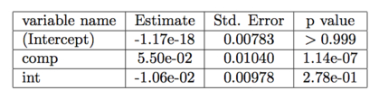
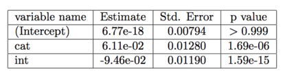
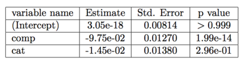
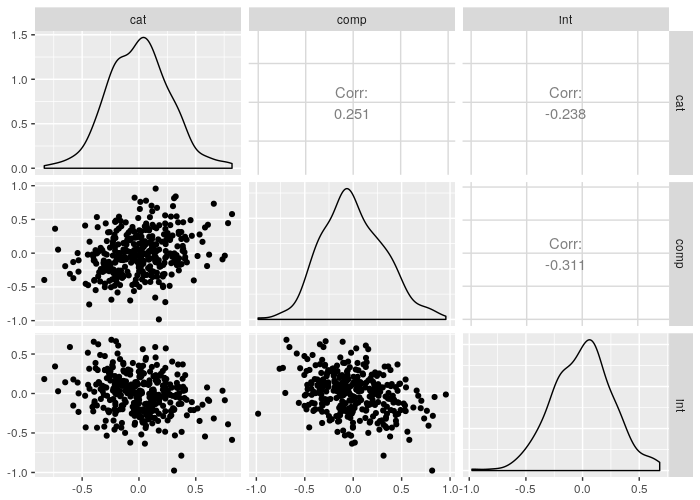
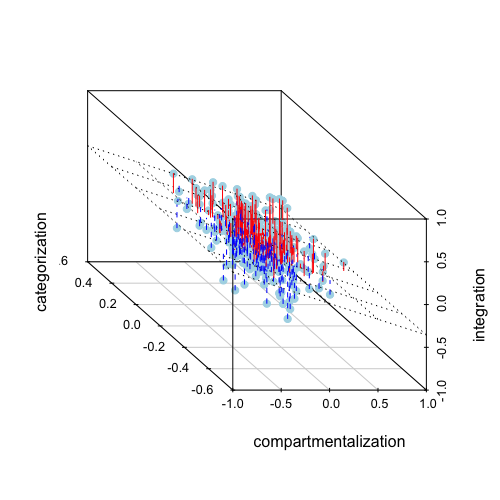

```{r setup, include=FALSE}
knitr::opts_chunk$set(echo = TRUE)
```

### Authorship

This Rmarkdown-generated html page is a web version of the STAT440 W18 end-of-term paper co-authored by [Rosie Zou](http://rosiezou.com) and [Ian Waudby-Smith](http://waudbysmith.com)

### Abstract
This project was motivated by the unique nature of survey designs and data collection, where often times a variable for particular topics of interest can only be obtained through indirect survey questions. This implicit representation of said topics makes data analysis and inference particularly challenging due to the fact that the values are not directly observable. To address this challenge, my project partner and I propose formulating it as a missing data problem and analyzing variables using multiple imputation. Specifically, we wish to impute missing data that represents the implicit topics of interest, herein referred to as latent variables. There are currently no existent R packages, to our knowledge, that solves this problem. For this project, we have developed and thoroughly tested an R package that, given ordinal responses to survey questions, performs analyses on imputed latent variables.

### Introduction and Problem Setup
In complex surveys, questions are sometimes designed and grouped according to overarching research themes. For example, Yampolsky et al. have developed a survey called *The Multicultural Identity Integration Scale (MULTIIS)* which uses 22 questions to address 3 major aspects of multicultural identity integration [@multiis]. Specifically, this survey aims to measure the degree to which responders experience *categorization*:  identifying with one cultural group over others by seeing one identity as predominant, *compartmentalization*: having multiple cultural identities that are kept in their own isolated compartments within the self, and *integration*: cohesively connecting and reconciling one’s multiple cultural identities within oneself [@multiis]. Instead of asking survey takers directly about their experiences with these aspects of multicultural identity integration, *MULTIIS* asks 5, 9, and 8 ordinal-response questions that aim to quantify their experiences with categorization, compartmentalization, and integration, respectively.


Given responses to this survey, the researcher may be interested in analyzing the relationship between these underlying themes. For example, it may be of interest to the creators of *MULTIIS* if categorization and compartmentalization are correlated. Moreover, it may be of interest to perform a statistical analysis on any arbitrary number of these underlying themes. However, none of these themes are directly observed as *variables*, and the researcher is left to extrapolate (or *impute*) a reasonable quantification of these themes from the directly observed survey responses.


Figuring out how, and how best to impute observations given partially observed data is a fundamental problem in statistics and is often referred to as "missing data" [@missdata]. In general, missing data is a well-studied problem and there are many R packages for it, most notably the MICE package. For a data set with missing values, MICE creates multiple replacement values for multivariable missing data of various types -- including continuous, binary, un-ordered categorical, and ordered categorical -- which can then be used in conjunction with the built-in pooling functions for inferences using missing data [@mice].


In this project, we propose a method to impute these types of underlying variables given ordinal survey responses. Specifically, we frame this imputation as a missing data problem and perform multiple imputation as described by Rubin [@multimp] to obtain parameter estimates and their associated uncertainty. Throughout, we use the *MULTIIS* survey as a motivating example; moreover, we apply our methodology to a real data set of responses to the survey.

### Methodology
In order to generate observations of these underlying latent variables, we must make some assumptions about their relationship with observed responses. In the case of *MULTIIS*, we need to make assumptions about how survey responses are derived from respondents' experiences with categorization, compartmentalization, and integration. 

Let $L_1, L_2, \dots, L_p$ denote the $p$ underlying latent variables. Let $x^*_{ijk}$ denote the $i^{th}$ ordinal response to the $j^{th}$ question corresponding to underlying latent variable $L_k$. Let $-\infty = \zeta_1, < \zeta_2 < \cdots < \zeta_{t_{jk}} = \infty$ be the possible responses to the $j^{th}$ question of underlying variable $k$. We assume

$$\begin{pmatrix}
L_1 \\ \vdots \\ L_p
\end{pmatrix} \sim \mathcal N_p(0, \Sigma)$$

$$x_{ijk} = a_{jk} L_k + \epsilon, \quad \epsilon \sim N(0, \sigma_{jk}), \quad a_{jk} \in \bf R$$

<center>with</center>

$$x^*_{ijk} = r_\ell \iff L_{jk} < x_{ijk} \leq U_{jk}$$

where $L_{jk}$ and $U_{jk}$ are some lower and upper bounds that determine the observed $x^*_{ijk}$. These bounds will be made explicit in our algorithm for generating $x_{ijk}$ given $x^*_{ijk}$.

To impute observations of $x_{ijk}$ from $x^*_{ijk}$, we employ an approach motivated by MICE [@mice]. Firstly, let *data* be the original dataset of ordinal survey responses. We then create a dataset called `data_interp` which contains samples from a standard normal based on the estimated quantile into which $x^*_{ijk}$ falls. For example, if responses are on a 1--5 scale, and 10% of responses are 1, with 15% being 2, then if $x^*_{ijk} = 2$, we sample $x_{ijk}$ from $N(0,1) \cdot \textbf{I}(0.1 < z \leq 0.15)$, a truncated normal between probabilities 0.1 and 0.15. We repeat this procedure for each $x^*_{ijk}$. This process is summarized in the following pseudo-code.

```{r eval = FALSE}
FUNCTION Interp(data):
  data_interp = data;
  for column in column_names(data) do:
    responses = data[column];
    range_responses = range(responses);
    responses_indicator = apply(to each i in range_response, 
                                function = {return 1 if responses == 1, 
                                  return 0 otherwise});
    probs = cumulative_sum(column_sumns(responses));
    quantiles = append(-inf, qnorm(probs, mean = 0, sd = 1));
    lower = quantiles[responses];
    upper = quantiles[responses + 1];
    data_interp[column]~N(0,1) * I(lower < z <= upper);
  end loop
  return (data_interp)
```

The previous step serves as an "initialization". We now iteratively update our samples of $x_{ijk}$ using a technique inspired by MICE. Specifically at iteration $t$, we draw ordinal values for column $q$ using probit regression for the distribution, $x^{*}_{q} | x^{(t)}_{-q}$, and do this for each column. Here $x^{*}_q | x^{(t)}_{-q}$ is the distribution of observed ordinal responses given the imputed continuous variables at the $t^{th}$ step. We then simulate $x_q | x^{*}_q$ from the appropriate truncated normal distribution. This algorithm is more concretely described in the following pseudo-code. Let `data` be the dataset of ordinal responses, and let `num_iter` be the number of times to update the samples of $x_{ijk}$.

```{r eval = FALSE}
FUNCTION Impute(data, num_iter = 5):
  data_interp = Interp(data);
  data_analysis = data_interp;
  for iteration from 1 to num_iter do:
    for column in column_names(data) do:
      probit_model = probit(data[column]~data.analysis[-column]);
      quantiles = append(-inf, probit_model.zeta_values, inf);
      sim_bins = simulate(probit_model);
      lower = quantiles[sim_bins];
      upper = quantiles[sim_bins + 1];
      data_analysis[column]~N(0,1) * I(lower < z <= upper);
    end loop
  end loop
  return (data_analysis)
```

Now, recall from our assumptions,

$$x_{ijk} \sim a_{jk}L_k + \epsilon, \quad \epsilon \sim N(0,\sigma_{jk}), \quad a_{jk} \in \bf R$$

Using `Impute(data)`, we may obtain estimates for $x_{ijk}$, which we shall denote by $\hat x_{ijk}$. Note that the above assumptions combined with our estimates, $\hat x_{ijk}$ is exactly the setup for a factor analysis with one common factor. Therefore, using either Thompson's regression method [@thompson] or Bartlett's weighted least-squares [@bartlett], we obtain a vector of estimates of factor scores, which in this case are estimates of $L_k$. We repeat this process for each $k$ to obtain vectors of estimates for $L_1, \dots, L_p$. We then obtain $M$ datasets of underlying latent variable estimates as follows.

```{r eval = FALSE}
FUNCTION Generate_Latent_Vars(data, M):
  data_sets = list();
  for i from 1 to M do:
    data_set = data_frame()
    imputed = Interp(data)
    for k from 1 to num_latent_vars do:
      imp_k = imputed[cols corresponding to L_k];
      factor_scores = factanal(imp_k)
      scores_data_set[k] = factor_scores
    end loop
    data_sets[i] = data_set
  end loop
  return (data_sets)
```

Recall that we are ultimately interested in analyzing relationships between underlying latent variables. Using our function `Generate_Latent_Vars` and multiple imputation, we may obtain estimates of, and perform hypothesis tests on any normally distributed parameter that can be computed from each dataset that is returned from `Generate_Latent_Vars`. Specifically, we use Rubin's rules [@multimp] for a normally distributed parameter $\theta$. For $t \in \{1, \dots, M\}$, let ${\hat{\theta}}_{t}$ be an estimate of $\theta$ derived from the $t^{th}$ dataset, and let SE$(\hat{ \theta}_{t})$ be an estimate of the standard error of $\hat{\theta}_{t}$. Then we obtain pooled estimates of $\hat{\theta}$ and SE$(\hat{\theta})$ using the following equations.

$$\hat \theta_{pool} = \bar{\theta} = \frac{\sum_{t = 1}^M\hat{\theta}_{t}}{M}$$

$$Var_{within} = \sum_{t=1}^M \frac{SE(\hat{ \theta}_{t})}{M}$$

$$Var_{between} = \frac{\sum_{t=1}^M(\hat {\theta}_{t} - \bar{\theta})^2}{M-1}$$

$$Var_{total} = Var_{within} + Var_{between} + \frac{Var_{between}}{M}$$

$$SE_{pool}(\hat{\theta}) = \sqrt{Var_{total}}$$

Given ${\hat{\theta}}_{pool}$ and SE$_{pool}(\hat{\theta})$, we may perform ordinary $Z$-tests.

In our R package, we use this multiple imputation method to perform a regression analysis for linear models. We do so in the obvious way: obtain pooled estimates, $\hat{\beta_i}$ and SE$_{pool}(\hat{\beta_i})$ and use (asymptotic) normality to test the null hypothesis, $H_0: \beta_i = \beta^{(null)}_i$ for each $\beta_i$. 

### Results
In this section we will demonstrate our multiple imputation method and pooling of analyses using the *MULTIIS* dataset. Recall that we are interested in the relationships between the three latent variables: categorization (Cat), compartmentalization (Comp), and integration (Int). We may generate estimates of these latent variables using the `Generate_Latent_Vars` function to produce $M$ datasets of factor scores. Although this R package is capable of generating factor scores using Bartlett's method [@bartlett] or Thompson regression scores [@thompson], we focus on Bartlett's factor scores (the default option in this package) as these are unbiased estimators of the true factor scores [@bartlett]. Moreover, the results using Thompson scores are not too different, and we omit them for brevity but the interested reader can find them in the appendix.

The function `pool.analyses` generates a pooled linear regression analysis by taking $M$ datasets containing latent variables, a regression formula, and calculates the sample mean and sample variance of $p$ parameters in $M$ sets of data. Moreover, this function performs a Z-test with null hypothesis $H_0: \beta_i = 0$ for $i = 1 \dots p$. For this example, we will generate $M = 100$ imputed data sets with `num.iter = 5`. Since there are $3$ latent variables in total, it is convenient to enumerate through all $3$ and construct $3$ additive linear regression models. This step is illustrated in the code block below:

```{r eval = FALSE}
library(stat440pkg)

# This just indicates which latent variable each column corresponds to
grp.indicator <- sapply(names(multiis), FUN =
                          function(x){strsplit(x, split = "_")[[1]][2]})
latent.datasets <- gen.latent.datasets(100, multiis,
                     grp.indicator = grp.indicator, num.iter = 5)
pooled.add1 <- pool.analyses(latent.datasets, cat~comp + int, lm)
pooled.add2 <- pool.analyses(latent.datasets, comp~cat + int, lm)
pooled.add3 <- pool.analyses(latent.datasets, int~comp + cat, lm)
```

Code Output:

<center></center>

<center>Table 1: Summary Results for formula $Cat \sim Comp + Int$</center><br>

<center></center>

<center>Table 2: Summary Results for formula $Comp \sim Cat + Int$</center><br>

<center></center>

<center>Table 3: Summary Results for formula $Int \sim Comp + Cat$</center><br>

As seen in the above tables, there seems to exist a strong relationship between compartmentalization and categorization, and between compartmentalization and integration while controlling for all latent variables. 

We graphically demonstrate the linear relationship between all three variables using a 2-dimensional pairwise scatter plot in Figure 1, along with a 3-dimensional scatterplot containing the regression plane for the model `lm(int ~ comp + cat, data = averaged)` in Figure 2. Here, `averaged` is the average of the $M$ generated latent datasets.

<center></center>

<center>Figure 1: Pairs plot including pairwise scatterplots between latent variables on the lower triangle, correlation coefficients on the upper triangle, and density histograms on the diagonal</center>

<center></center>

<center>Figure 2: 3D scatterplot of categorization, compartmentalization, and integration variables with a regression plane for the model, Int $\sim$ Comp + Cat</center><br>


The two hyper-parameters that could influence the inference results are batch size (M imputed data sets) and the number of iterations (`num_iter` in the algorithm for `impute_response`, and `num.iter` in the R package's `gen.imp.resp` function). Ideally we would like to perform a grid search to find the optimal value for both of these parameters before generating the data sets used for pooling. However, since the existence of these underlying latent variables is hypothesized to begin with, there is currently no method for us to check the accuracy of the inferences. 


### Discussion

In this project we have designed and implemented a new method in R to make inferences about the relationships between some supposed underlying factors in survey data, assuming at least one survey question for $k$ different underlying factors, which we treat as latent variables, and a question response that takes on an ordinal value. We then treat these latent variables as missing values and use a series of steps to obtain a final imputation. Currently our pooling function only supports linear regression analyses on the imputed latent variables, which is one of the major limitations of our package. Given more time, we would enhance the pooling function to support more families in generalized linear models, and potentially other non-GLM models, provided a pooling method exists.

Currently we are using quantile regression for discrete-to-continuous variable mapping and factor analysis for missing data generation. An additional package enhancement is to support more imputation methods in the `gen.imp.resp` function. An earlier idea in our project proposal was to use localized kernels and construct smoother functions like natural cubic splines that would map the discrete variables to continuous values. The drawback of this idea in the context of multiple imputation for surveys, is that it ignores the relationship among an individual's responses for different questions. However, given more time, we could leverage the variety of built-in smooth classes such as thin-plane splines and p-splines provided in the R GAM package to construct multivariable regression splines, which would be an improvement to our original kernel function idea, with the said correlations properly addressed[@gam1, gam2, gam3, gam4, gam5].

Another drawback of our model is the strong assumption that the latent variables are actually relevant or existent. This is an interdisciplinary problem and depends on the survey designer's expert opinions as well as proficient background in the questionnaire-specific fields of research. This is not something we can rectify on our own but should be kept in mind for statisticians who would like to use our R package.

For future research, we would like to extend our methodology to non-normally distributed parameters like $F$-statistics and enhance the pooling step to perform $t$-tests that do not rely on asymptotic normality.  There could also potentially be better ways to estimate the factor scores, which we hope to discover.

Additionally, the current pooling step only supports parametric models despite the fact that some non-parametric models such as tree-based methods and feed forward neural networks could potentially out-perform parametric ones when modelling the relationships between variables. For future research, we hope to see if an analogue of Rubin's Rule for multiple imputation with nonparametric methods exists.

Currently, the run time of the code does not scale well for larger numbers of iterations and batch sizes. This is due to the fact that `gen.imp.resp()` uses the `polr()` function from the MASS package `mass`, which takes approximately $0.12s$ to run (based on observations on our personal laptops). To produce $M$ imputed data sets, `polr()` needs to be called once per column per iteration per data set. In our example, $22$ `cols` $\times $ `num.iter` $\times $ `M` $\times 0.12s$ results in approximately $22$ minutes of run time for `num.iter` = 5 and `M` = 100. This issue can be addressed by the `mcapply` function in R, which spawns a parallel thread for every element in the argument array of an `lapply` function. We were unable to explore the full potential of parallel computing due to time constraints, but it is something to keep in mind for future development.


### References